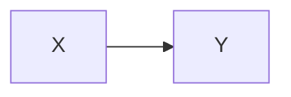
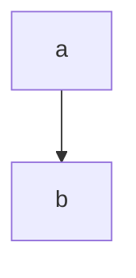
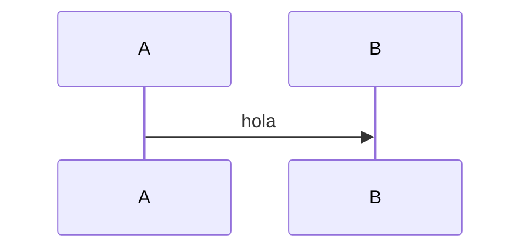

# Fixture mixto (A3.1)


```mermaid
flowchart LR
  X --> Y
```

Bloque intermedio sin mermaid:

```
esto es bash, no se valida
```


```mermaid
flowchart TD
  M["a"] --> N["b"]
```


```mermaid
sequenceDiagram
  participant A
  participant B
  A->>B: hola
```

```mermaid
flowchart TD
  X[unclosed
```
